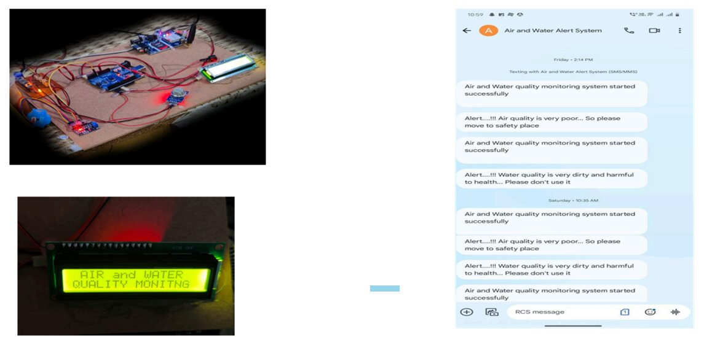

# Air and Water Quality Index and Environment Monitoring(IoT Project)

This project monitors the **Air Quality Index (AQI)** and **Water Quality Index (WQI)** using various environmental sensors. The data is read by an **Arduino** microcontroller and can be used for environmental tracking, pollution detection, or automation systems.

## Hardware Components

- Arduino Uno
- GSM Module
- Air Quality Sensor(MQ-135)
- Water Quality Sensor(Turbidity)
- Buzzer
- LCD Display
- Power Supply
- USB Cable

## Circuit Diagram

## Code Upload Instructions

- Connect the Arduino Board
- Open Arduino IDE
- Load the Sketch
- Select the Board and Port
- Verify the code
- Run and Test

## Required Libraries

- LiquidCrystal_I2C
- SoftwareSerial

## Output

- Data is printed on the **LCD**.
- Air Quality, Water Quality are shown.

## Notes

- Make sure all sensors are powered correctly (e.g., 5V or 3.3V).
- Calibration might be required for accurate sensor readings.
- Avoid virtual simulations — this code is meant for physical deployment on hardware.

## Demo

## Author

Siri Reddy Redabothu

